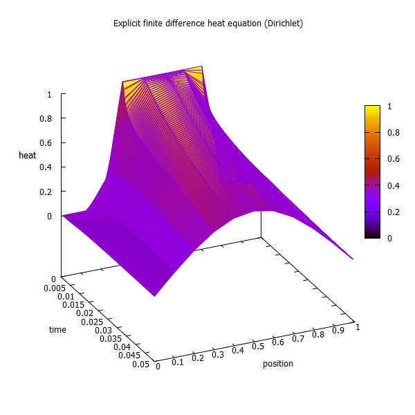
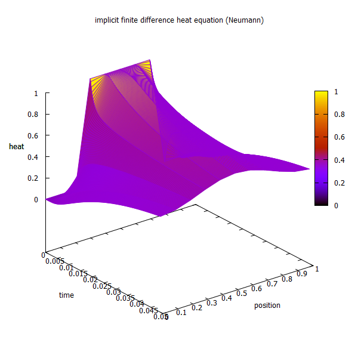

# HeatEqnFD

This program provides a solution to the 1-d heat equation via a finite difference scheme. The two schemes present are 
either an explicit Dirichlet or implicit Neumann scheme. The program plots the output data using [gnuplot 4.2](http://www.gnuplot.info/download.html) 
or greater, gnuplot should either be on your path  or line 74 in heat_eqn.c should be uncommented and the respective path for your 
gnuplot executable should be entered.

The executable was compiled using mingw32 on Win7 64 bit.

# Installation

# *nix
If you have homebrew installed run:
~~~
git clone git://github.com/fnarify/HeatEqnFD
cd HeatEqnFD
make heat_eqn
~~~

(if you need to install gnuplot, and have homebrew installed)
~~~
brew install gnuplot
~~~

Note, that in both plotn and plotd the command **set terminal wxt 600, 600** will not work on most default gnuplot installations. Which requires you to install with wxWidgets dependencies. For the sake of simplicity either remove that line from the file or rebuild gnuplot with:
~~~
sudo apt-get install gnuplot-x11
~~~

# Win
Download the zip of the project ('Clone or download' button near the top right-hand corner, or with git if you have it installed) and run heat_eqn.exe, or compile it with whatever means you like. Make sure gnuplot 4.2 or greater has been downloaded from the link above.
